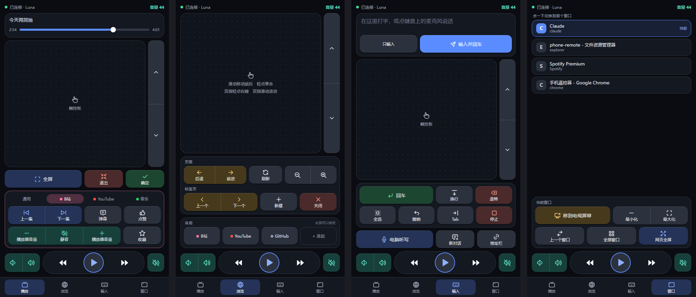

# 手机遥控器

[English](README.md) | **中文**

在电脑上运行一个小程序，手机浏览器打开网页，就能遥控电脑上的视频播放：音量、播放暂停、快进快退、触控板、滚动、文字输入，以及 B 站、YouTube、浏览器和 AI 客户端的常用快捷键。

Windows 和 macOS 通用，用 Python 编写。手机和电脑需要在同一个 Wi-Fi 下。手机上不用安装任何东西：iPhone、iPad、Android 手机和平板都可以，用自带的浏览器打开即可。

## 运行

最省事的是[发布页](https://github.com/chrisye96/phone-remote/releases/latest)上打包好的程序，不需要装 Python：Windows 下载 `PhoneRemote.exe`，Apple 芯片的 Mac（M1 及以后）下载 `PhoneRemote-macOS-AppleSilicon.zip`，Intel 处理器的 Mac 下载 `PhoneRemote-macOS-Intel.zip`。Mac 上第一次启动的步骤写在发布页里。想从源码运行的话：

Windows：双击 `start-windows.bat`。第一次运行会在仓库里建一个 `.venv` 虚拟环境并安装依赖，需要联网，大约一分钟。

macOS（先安装一次，以后只需要最后一行）：

```bash
python3 -m venv .venv
```

```bash
.venv/bin/python -m pip install -e .
```

```bash
.venv/bin/python -m phone_remote
```

第一次在 Mac 上运行，需要在 系统设置 > 隐私与安全性 > 辅助功能 里给"终端"授权（用打包好的应用时，授权的是 "PhoneRemote"）。没有授权时，二维码页面顶部会显示操作步骤。

启动后没有窗口，程序在任务栏右下角的托盘里运行（Mac 上是菜单栏），并弹出二维码页面，用手机相机扫码即可。想下次像 App 一样打开，可以把页面添加到主屏幕：Safari 里点 分享 > 添加到主屏幕，Android 的 Chrome 里点 菜单 > 添加到主屏幕。

右键托盘图标可以：显示二维码、打开或关闭开机自动启动（默认关）、重新配对、切换语言、退出。“关于”一项显示当前运行的版本号，点它会打开本项目的主页；版本号也显示在二维码页面底部，以及手机上的设置里（右上角的齿轮）。出问题时看日志 `%APPDATA%\PhoneRemote\phone-remote.log`。

### 语言

界面默认是英文，可以换成中文，两处各自设置：

- **手机上的遥控器**：点右上角的齿轮，在“语言”里选。每台手机各自记住。
- **电脑上的托盘菜单和二维码页面**：托盘菜单的 Language（语言）。命令行模式下把配置文件里的 `language` 改成 `zh`。

想在命令行窗口里运行（方便看输出）：`.venv\Scripts\python -m phone_remote --console`。

### 更新

程序每天向 GitHub 问一次最新发布版的版本号。有新版本时，托盘菜单里会多出一项“有新版本”，点它会打开[发布页](https://github.com/chrisye96/phone-remote/releases/latest)，在那里下载新的文件（`PhoneRemote.exe`，或者对应你那台 Mac 的 zip）替换旧的即可。程序不会自动下载或安装任何东西。从源码运行的话用 `git pull`。

这是程序唯一会主动访问互联网的地方。不想要的话，把配置文件里的 `check_updates` 改成 `false`。

手机上的遥控器页面不需要更新：它是电脑上的程序提供的，电脑是什么版本它就是什么版本。

## 打包成免安装的程序

Windows：双击 `scripts\build-windows.bat`，会在 `dist\` 里生成一个 `PhoneRemote.exe`（约 20 MB）。把它拷到别的 Windows 电脑上双击就能用，不需要装 Python。

macOS：运行 `sh scripts/build-macos.sh`，会在 `dist/` 里生成 `PhoneRemote.app` 和它的 zip。这个应用只能在同一种 Mac 上运行（Apple 芯片或 Intel），而且没有用 Apple 开发者账号签名，所以拿到别的 Mac 上第一次打开时需要手动确认。

正式发版由 GitHub Actions 用同样的方式打包：推送 `v0.5.0` 这样的 tag 会跑测试、打包 exe 和两个 Mac 应用并发布到发布页（`.github/workflows/release.yml`）。每个 PR 也会跑测试并试打包一次。

## 遥控器的四个页面



（截图是旧版界面，按键名称可能和现在略有不同。）

- **播放**：正在播放的内容（音乐或视频的图标、标题和歌手、来源 App）和可拖动的进度条、触控板、全屏 / 退出 / 确定，以及通用、B 站、YouTube、音乐四组专用键。
- **浏览**：触控板、浏览器的后退前进、刷新、缩放、标签页切换，以及“常用”网页快捷方式。
- **输入**：在手机上打字或听写，发到电脑当前的输入框。点一下输入框，它会放大到占满屏幕，方便写长文字；换行会保留（发送时用的是 Shift+Enter，因为在多数聊天框里直接回车会把没写完的内容发出去），最多 10000 字。下面是编辑键（回车、换行、退格、全选、撤销、Tab、地址栏）和控制键。控制键直接用键名，因为同一个键在不同程序里含义不同：上、下、Shift+Tab、Esc、Ctrl+C。“AI 新对话”发送的是 Ctrl/Cmd+Shift+O，在 ChatGPT 里是新建一个对话。
- **窗口**：列出电脑上打开的窗口，点一下切换过去；可以最大化、最小化。“移到另一块屏幕”（仅 Windows）把当前窗口挪到下一块显示器上，比如电脑接着电视当第二块屏幕时，把视频窗口送到电视上。Mac 上列出的是应用。

触控板的用法和笔记本的一样：滑动移动指针，轻点单击，双指轻点右键，双指滑动滚动（快速一甩会继续滚一段再慢慢停下）。要拖动的话，手指按住不动，等边框变成实线后再滑动，松手即放开。

底部常驻一条播放条：音量减和加、快退、播放暂停、快进、静音。

按键的颜色表示功能：蓝色是播放和主操作，青色是音量，绿色是确认，黄色是跳转，红色是退出、关闭和删除。播放暂停键用的是 logo 的青色，因为它是最常按的键。

### 常用网页

浏览页的“常用”里最多放 4 个网页快捷方式，点一下就在电脑的浏览器里打开。点“+ 添加”填网址（写 `bilibili.com` 这样就行），名称留空会自动读取网页名称，圆点的颜色取自网页的主题色或图标。长按一个快捷方式可以修改或删除（用键盘时按菜单键或 Shift+F10）。它们保存在配置文件的 `shortcuts` 里。

### 平板，以及横着拿手机

页面会按屏幕的形状重新排布：

- **手机横屏**：导航在最左边竖着排，按键在中间，触控板在右边占满整个高度。
- **平板横屏**：同样的三栏，按键更大。空间够用，所以通用键和某个网站的专用键同时显示，播放页上也有常用网页。
- **平板竖屏**：触控板横在上面，按键在下面分成两栏。

如果你习惯用左手拇指控制指针，在设置（齿轮）里把触控板换到左边，横屏时生效。

### 键盘和读屏

所有按键、导航和设置也可以用键盘、开关控制或读屏（TalkBack、VoiceOver）操作：每个按键都有能读出来的名称，当前所在的页面和分页也会读出来。触控板和拖动进度条仍然需要手指，滚动键和快进快退键可以代替它们。

### 遥控多台电脑

每台电脑各运行一份本程序。先扫其中一台的二维码打开遥控器，然后点顶部的电脑名称：

- **添加电脑…**：粘贴另一台电脑二维码页面上的网址（用相机扫它的二维码，复制识别出的链接；没有“复制”按钮就长按链接），可以顺便起个名字。
- 点名称切换到那台电脑。
- **改名…**、**移除**：针对当前这台。

名称默认是电脑自己的主机名。电脑列表保存在手机的浏览器里，换一台手机要重新添加。所有电脑上的程序都要是带这个功能的版本。

## 安全

- **配对码不经过网络**。它只在二维码和手机里；每条指令带的是用配对码算出的签名和时间，旁人抓包拿不到配对码，把抓到的指令重发一遍也无效。
- **猜错会被拒之门外**。同一个地址连续 10 次签名不对，5 分钟内不再理它。
- **重新配对**。托盘菜单里点“重新配对”（命令行模式用 `--reset-pairing`），立刻换一个新的配对码，之前配对过的手机全部失效，要重新扫码。手机丢了、或者把二维码给别人看过，就点一下。
- **指令内容没有加密**。同一个网络里能抓包的人看得到你按了什么键、输入了什么字。在自己家或者自己的手机热点上没有问题；在公司、宿舍、咖啡馆的 Wi-Fi 上不要用“输入”页打密码。

电脑换了网络（比如连到手机热点）后地址会变，右键托盘图标重新“显示二维码”再扫一次。Windows 如果把这个网络当成“公用网络”，防火墙可能拦住手机的连接，需要在弹出的提示里允许，或把该网络改成“专用”。

## 功能开关

每个功能都可以单独关掉。第一次运行后会生成配置文件（启动时会打印它的位置，Windows 上在 `%APPDATA%\PhoneRemote\config.json`），把 `features` 里对应的一项改成 `false`，重启程序即可。关掉后电脑端会拒绝对应的指令，手机页面上也不再显示那一块。

| 开关 | 功能 |
|---|---|
| `touchpad` | 触控板：移动鼠标、点击、滚动 |
| `text_input` | 文字输入 |
| `windows` | 窗口列表和切换 |
| `play_state` | 显示正在播放还是暂停，以及标题 |
| `progress` | 进度条、拖动跳转、±30 秒 |
| `volume_display` | 显示音量数值 |
| `sleep_timer` | 定时暂停 |
| `open_sites` | 网页快捷方式 |
| `site_keys` | B 站、YouTube 的专用按键 |
| `browser_keys` | 浏览器按键 |

音量、播放暂停、快进快退和基本按键是核心功能，不能关。

## 代码结构

```
src/phone_remote/
  __main__.py      入口
  config.py        端口、配对码、功能开关
  server.py        HTTP 服务器：页面文件、配对校验
  actions.py       指令校验和分发
  keys.py          按键名表、组合键解析
  timer.py         定时暂停
  pairing.py       二维码页面
  siteinfo.py      读取网页的名称和代表色（添加快捷方式时用）
  tray.py          托盘图标和菜单
  autostart.py     开机自动启动的开关
  update.py        向 GitHub 查询有没有新版本
  i18n.py          电脑端的界面语言（手机页面的在 web/js/i18n.js）
  platforms/       每个系统一套实现，其他代码只用 base.py 里的接口
    base.py
    windows/       input.py  windows.py  media.py  audio.py
    macos/         input.py  windows.py  media.py
  web/             手机页面：index.html、css/、js/（按功能分模块）、icons.svg
tests/             自动测试，不碰真实的键盘鼠标
scripts/           打包脚本、图标合成脚本、logo 生成脚本
docs/              重构计划
```

运行测试：双击 `run-tests.bat`。

## 分支

- `main`：可以直接用的稳定版本。
- `dev`：日常开发。新功能从 `dev` 拉 `feature/*` 分支，完成后合回 `dev`，验证过再合到 `main`。

## 支持

手机遥控器是免费的。如果它对你有用，可以[支持一下这个项目](https://buymeacoffee.com/chrisye)。

## 图标

图标来自 [Tabler Icons](https://tabler.io/icons)（MIT 协议），只把用到的几十个合成进了 `src/phone_remote/web/icons.svg`，运行时不依赖外网。增减图标见 `scripts/build-icons.py`。

logo 画在 `src/phone_remote/logo.py` 里：48 像素以上用完整版，16 和 32 像素用只有一道信号弧的简化版。`scripts/build-logo.py` 由它生成所有文件：`web/` 里的 favicon 和主屏幕图标（iOS 一个；Android 四个，列在 `web/manifest.webmanifest` 里，其中两个铺满整个方形，由桌面裁成它自己的形状）、`docs/logo.svg`、Windows 图标 `scripts/phone-remote.ico`。托盘图标在程序启动时由同一个模块画出来。
